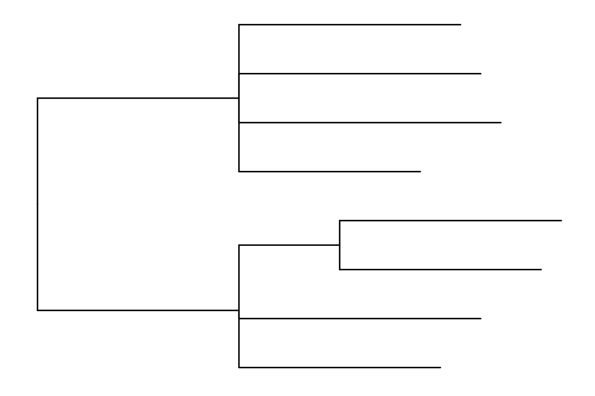

# Using ggtree to Visualize Data on Tree-Like Structure

If you use this work in published research, please cite:


__G Yu__<sup>\*</sup>. Using ggtree to Visualize Data on Tree-Like Structure. __*Current Protocols in Bioinformatics*__, 2020, 69(1):e96, <https://doi.org/10.1002/cpbi.96>.


----

This repo contains source code and data to reproduce figures of the above paper.


```{r include=FALSE}
library(ggplot2)
library(ggmsa)
library(Biostrings)
library(ape)
library(phytools)
library(treeio)
library(ggtree)

knitr::opts_chunk$set(fig.path="figures/")
```


## BASIC PROTOCOL 1


```{r fig.width=6, fig.height=4}
library(treeio)
library(ggtree)
treetext = "(((ADH2:0.1[&&NHX:S=human], ADH1:0.11[&&NHX:S=human]):
0.05 [&&NHX:S=primates:D=Y:B=100],ADHY:
0.1[&&NHX:S=nematode],ADHX:0.12 [&&NHX:S=insect]):
0.1[&&NHX:S=metazoa:D=N],(ADH4:0.09[&&NHX:S=yeast],
ADH3:0.13[&&NHX:S=yeast], ADH2:0.12[&&NHX:S=yeast],
ADH1:0.11[&&NHX:S=yeast]):0.1[&&NHX:S=Fungi])[&&NHX:D=N];"
tree <- read.nhx(textConnection(treetext))
p <- ggtree(tree)
```

```{r echo=F}
p11 = p
ggsave(p11, file="figures/f1.1-tree.png", width=6, height=4)
ggsave(p11, file="figures/f1.1-tree.pdf", width=6, height=4)
```



```{r fig.width=7, fig.height=4,warning=F}
p2 <- p + geom_tiplab() + 
  geom_label(aes(x=branch, label=S), fill='lightgreen') + 
  geom_label(aes(label=D), fill='steelblue') + 
  geom_text(aes(label=B), hjust=-.5) +
  xlim(NA, 0.28) 
```

```{r echo=FALSE, warning=FALSE}
p12 = p2
ggsave(p12, file="figures/f1_2-tree.png", width=6, height=4)
ggsave(p12, file="figures/f1_2-tree.pdf", width=6, height=4)
```


## BASIC PROTOCOL 2


```{r fig.width=11, fig.height=5.4}
expr <- read.table("mskcc.txt") 
d <- as.dist(1 - cor(expr, method="pearson"))
hc <- hclust(d, "ward.D")

p <- ggtree(hc, linetype='dashed',size=1) + layout_dendrogram() +
   theme_dendrogram() +
   geom_tiplab(angle=90, hjust=1, offset=-.05, show.legend=FALSE) 
```

```{r echo=F}
p21 <- p
ggsave(p21, filename = "figures/f2_1-dendrogram.png", width=11, height=5.4)  
ggsave(p21, filename = "figures/f2_1-dendrogram.pdf", width=11, height=5.4)  
```


```{r}
clus <- cutree(hc,k=2)
g <- split(names(clus), clus)

p <- groupOTU(p, g, group_name='Cluster') + aes(color=Cluster) + 
  scale_color_manual(breaks=c(1,2), values=c("#2874C5","#EABF00"))
```

```{r echo=F}
p22 <- p
ggsave(p22, filename = "figures/f2_2-dendrogram-color.png", width=11, height=5.4)  
ggsave(p22, filename = "figures/f2_2-dendrogram-color.pdf", width=11, height=5.4)  
```


```{r}
surv <- read.table("mskcc_surv.txt")
surv.df <- data.frame(label = names(clus),
                         OS=surv$OS_STATUS,
                         PFS=surv$DFS_STATUS)

g2 <- p %<+% surv.df + 
  geom_tippoint(shape=21, aes(fill=OS), color='black', size=6) + 
  scale_fill_manual(values=c("LIVING"="#dcddde","DECEASED"="#700353"), 
                    na.value="white") +
  ggnewscale::new_scale_fill() +
  geom_tippoint(shape=21, aes(fill=PFS), color='black', size=3) +
  scale_fill_manual(values=c("DiseaseFree"="#dcddde",
                             "Recurred/Progressed"="#700353")) +
  theme(plot.margin=margin(6,6,30,6), legend.position=c(.5, .6)) 
```

```{r echo=F}
ggsave(g2, filename = "figures/f2_3-dendrogram-surv.png", width=11, height=5.4)  
ggsave(g2, filename = "figures/f2_3-dendrogram-surv.pdf", width=11, height=5.4)  
```


```{r, warning=FALSE}
g3 <- gheatmap(p, surv[, c("OS_STATUS", "DFS_STATUS")], width=.2, 
        colnames_position="top", offset=.3, hjust=0) + 
  scale_fill_manual(breaks=c("LIVING", "DECEASED", 
                            "DiseaseFree", "Recurred/Progressed"),
                    values=c('#700353', '#dcddde', '#dcddde', '#700353'), 
                    na.value="white", name = "Survival")
```

```{r echo=F, warning=FALSE}
ggsave(g3, filename = "figures/f2_4-gheatmap-dendrogram.png", width=11, height=5.4)  
ggsave(g3, filename = "figures/f2_4-gheatmap-dendrogram.pdf", width=11, height=5.4)  
```


## BASIC PROTOCOL 3


```{r}
library(ape)
library(ggplot2)
library(tidytree)
library(treeio)
library(ggtree)

data(woodmouse)
d <- dist.dna(woodmouse)
tr <- nj(d)
bp <- boot.phylo(tr, woodmouse, function(x) nj(dist.dna(x)))


bp2 <- tibble(node=1:Nnode(tr) + Ntip(tr), bootstrap = bp)
tree <- full_join(tr, bp2, by="node")

g4 = ggtree(tree, size=1.5) + 
    geom_tiplab(size=4.5, fontface="bold") + xlim(0, 0.02) + 
    geom_nodepoint(aes(fill=cut(bootstrap, c(0, 70, 90, 100))), 
                    shape=21, size=4) + 
    theme_tree(legend.position=c(0.8, 0.2)) + 
    scale_fill_manual(values=c("white", "grey", "black"), guide='legend', 
                    name='Bootstrap Percentage(BP)', 
                    breaks=c('(90,100]', '(70,90]', '(0,70]'), 
                    labels=expression(BP>=90,70 <= BP * " < 90", BP < 70))
```                    

```{r echo=FALSE}
ggsave(g4, filename = "figures/f3-bootstrap.png", width=7, height=7)   
ggsave(g4, filename = "figures/f3-bootstrap.pdf", width=7, height=7)   
```


## BASIC PROTOCOL 4

```{r}
library(ggimage)
library(ggtree)

tree <- read.tree("tree_boots.nwk")
info <- read.csv("taxa_info.csv")

mass <- info$mass_in_kg
names(mass) <- info$Newick_label
fit <- phytools::fastAnc(tree,mass,vars=TRUE,CI=TRUE)

td <- data.frame(node = nodeid(tree, names(mass)),
                 trait = mass)
nd <- data.frame(node = as.numeric(names(fit$ace)), 
                 trait = fit$ace)
d <- rbind(td, nd)

library(treeio)
tree2 <- full_join(tree, d, by = 'node')

pg <- ggtree(tree2, aes(color=trait), continuous = TRUE, size=3) +
  scale_color_gradientn(colours=c("red", 'orange', 'green', 'cyan', 'blue'), 
                        name="mass (kg)") + 
  geom_tiplab(hjust = -.2) + xlim(0, 4) 
```

```{r echo=F}
ggsave(pg, file="figures/f4_1-numeric-ancestral.png", width=10, height=6)
ggsave(pg, file="figures/f4_1-numeric-ancestral.pdf", width=10, height=6)
```


```{r}
trophic_habit <- setNames(info$trophic_habit, info$Newick_label)

cols <- RColorBrewer::brewer.pal(length(unique(trophic_habit)), "Set1")
names(cols) <- sort(unique(trophic_habit))
fitER <- ape::ace(trophic_habit,tree,model="ER",type="discrete")
ancstats <- as.data.frame(fitER$lik.anc)
ancstats$node <- 1:Nnode(tree)+Ntip(tree)

pies <- nodepie(ancstats, cols=1:3)
pies <- lapply(pies, function(g) g + scale_fill_manual(values = cols))

pg <- pg %<+% info +
  geom_tippoint(aes(fill = trophic_habit), shape=21, size=10, color='white') + 
  scale_fill_manual(values = cols) +
  geom_inset(pies, width = .2, height=.2) 
```

```{r echo=F}
ggsave(pg, file="figures/f4_2-category-ancestral.png", width=10, height=6)
ggsave(pg, file="figures/f4_2-category-ancestral.pdf", width=10, height=6)
```


```{r}
id <- phylopic_uid(info[,1])

gg <- pg %<+% id + 
  geom_tiplab(aes(image=uid), geom="phylopic", offset=.75, size=.1) 
```

```{r echo=F}
ggsave(gg, file="figures/f4_3-subplots.png", width=10, height=6)
ggsave(gg, file="figures/f4_3-subplots.tiff", width=10, height=6, compression='lzw', dpi=300)
```


## BASIC PROTOCOL 5

```{r warning=FALSE}
library(ape)
library(Biostrings)

fasfile <- system.file("extdata/sample.fasta", package = "ggmsa")
x <- readAAStringSet(fasfile)

d <- as.dist(stringDist(x, method = "hamming")/width(x)[1])
tree <- bionj(d)

library(ggtree)
library(ggmsa)

p <- ggtree(tree, size=1) + geom_tiplab()

data <- tidy_msa(fasfile, start = 160, end = 220)
p2 <- p + 
  geom_facet(geom = geom_msa, data = data,  
            panel = 'Multiple Sequence Alignment',
            color = "Chemistry_AA") + 
  xlim_tree(3)

pp <- facet_widths(p2, widths=c(.2, 1))
```

```{r echo=F}
ggsave(pp, filename = "figures/f5-msa.png", width=17, height=4)
ggsave(pp, filename = "figures/f5-msa.pdf", width=17, height=4)
```


