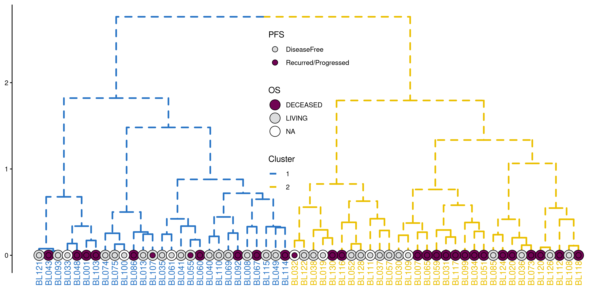
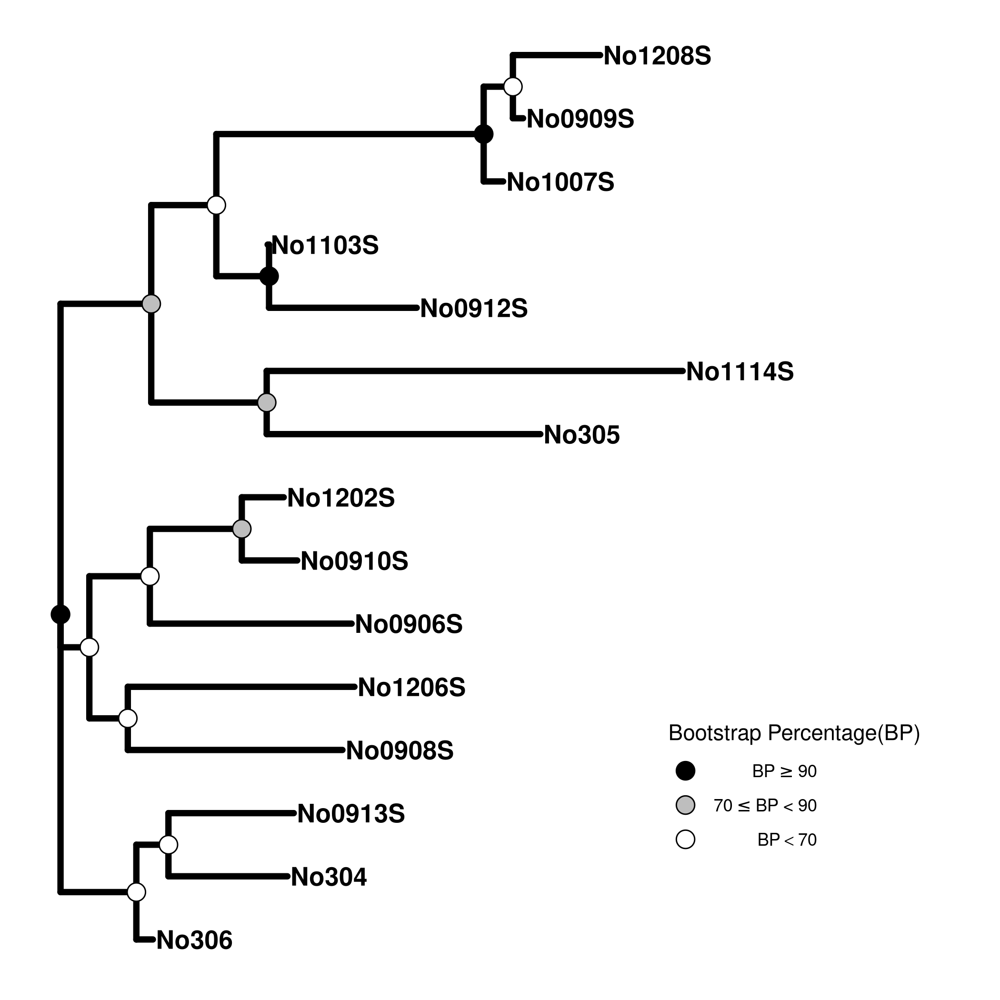
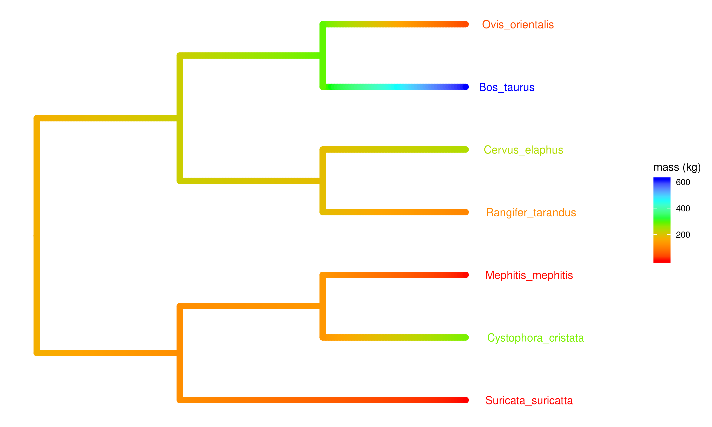
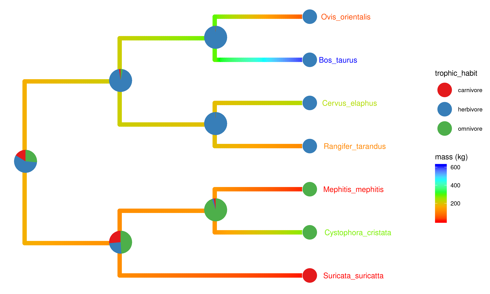
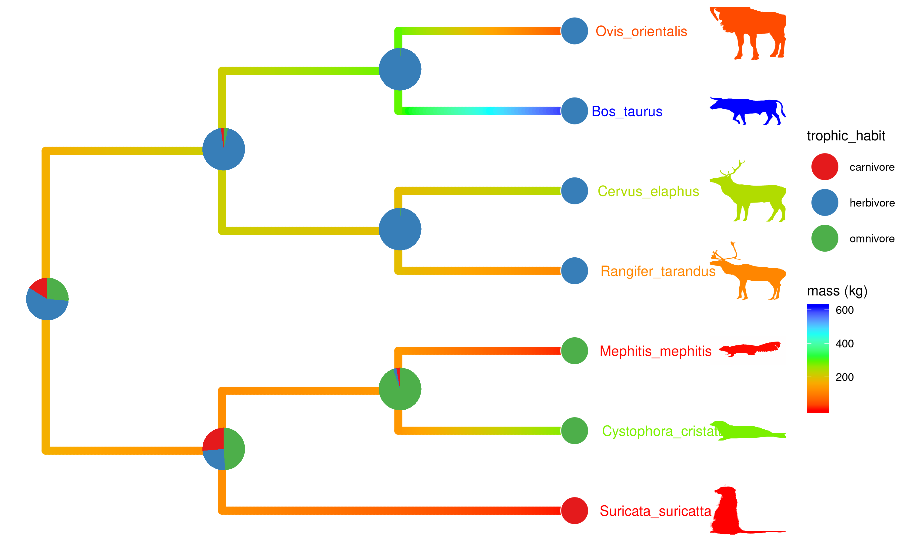
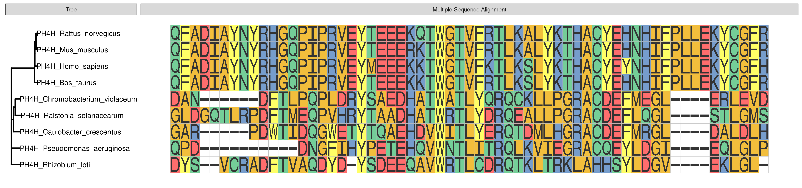

BASIC PROTOCOL 1
----------------

    library(treeio)
    library(ggtree)
    treetext = "(((ADH2:0.1[&&NHX:S=human], ADH1:0.11[&&NHX:S=human]):
    0.05 [&&NHX:S=primates:D=Y:B=100],ADHY:
    0.1[&&NHX:S=nematode],ADHX:0.12 [&&NHX:S=insect]):
    0.1[&&NHX:S=metazoa:D=N],(ADH4:0.09[&&NHX:S=yeast],
    ADH3:0.13[&&NHX:S=yeast], ADH2:0.12[&&NHX:S=yeast],
    ADH1:0.11[&&NHX:S=yeast]):0.1[&&NHX:S=Fungi])[&&NHX:D=N];"
    tree <- read.nhx(textConnection(treetext))
    p <- ggtree(tree)

    p2 <- p + geom_tiplab() + 
      geom_label(aes(x=branch, label=S), fill='lightgreen') + 
      geom_label(aes(label=D), fill='steelblue') + 
      geom_text(aes(label=B), hjust=-.5) +
      xlim(NA, 0.28) 

BASIC PROTOCOL 2
----------------

    expr <- read.table("mskcc.txt") 
    d <- as.dist(1 - cor(expr, method="pearson"))
    hc <- hclust(d, "ward.D")

    p <- ggtree(hc, linetype='dashed',size=1) + layout_dendrogram() +
       theme_dendrogram() +
       geom_tiplab(angle=90, hjust=1, offset=-.05, show.legend=FALSE) 

    clus <- cutree(hc,k=2)
    g <- split(names(clus), clus)

    p <- groupOTU(p, g, group_name='Cluster') + aes(color=Cluster) + 
      scale_color_manual(breaks=c(1,2), values=c("#2874C5","#EABF00"))

    surv <- read.table("mskcc_surv.txt")
    surv.df <- data.frame(label = names(clus),
                             OS=surv$OS_STATUS,
                             PFS=surv$DFS_STATUS)

    g2 <- p %<+% surv.df + 
      geom_tippoint(shape=21, aes(fill=OS), color='black', size=6) + 
      scale_fill_manual(values=c("LIVING"="#dcddde","DECEASED"="#700353"), 
                        na.value="white") +
      ggnewscale::new_scale_fill() +
      geom_tippoint(shape=21, aes(fill=PFS), color='black', size=3) +
      scale_fill_manual(values=c("DiseaseFree"="#dcddde",
                                 "Recurred/Progressed"="#700353")) +
      theme(plot.margin=margin(6,6,30,6), legend.position=c(.5, .6)) 

    g3 <- gheatmap(p, surv[, c("OS_STATUS", "DFS_STATUS")], width=.2, 
            colnames_position="top", offset=.3, hjust=0) + 
      scale_fill_manual(breaks=c("LIVING", "DECEASED", 
                                "DiseaseFree", "Recurred/Progressed"),
                        values=c('#700353', '#dcddde', '#dcddde', '#700353'), 
                        na.value="white", name = "Survival")

    ## Scale for 'fill' is already present. Adding another scale for 'fill',
    ## which will replace the existing scale.

BASIC PROTOCOL 3
----------------

    library(ape)
    library(ggplot2)
    library(tidytree)
    library(treeio)
    library(ggtree)

    data(woodmouse)
    d <- dist.dna(woodmouse)
    tr <- nj(d)
    bp <- boot.phylo(tr, woodmouse, function(x) nj(dist.dna(x)))

    ## 
    Running bootstraps:       100 / 100
    ## Calculating bootstrap values... done.

    bp2 <- tibble(node=1:Nnode(tr) + Ntip(tr), bootstrap = bp)
    tree <- full_join(tr, bp2, by="node")

    g4 = ggtree(tree, size=1.5) + 
        geom_tiplab(size=4.5, fontface="bold") + xlim(0, 0.02) + 
        geom_nodepoint(aes(fill=cut(bootstrap, c(0, 70, 90, 100))), 
                        shape=21, size=4) + 
        theme_tree(legend.position=c(0.8, 0.2)) + 
        scale_fill_manual(values=c("white", "grey", "black"), guide='legend', 
                        name='Bootstrap Percentage(BP)', 
                        breaks=c('(90,100]', '(70,90]', '(0,70]'), 
                        labels=expression(BP>=90,70 <= BP * " < 90", BP < 70))

BASIC PROTOCOL 4
----------------

    library(ggimage)
    library(ggtree)

    tree <- read.tree("tree_boots.nwk")
    info <- read.csv("taxa_info.csv")

    mass <- info$mass_in_kg
    names(mass) <- info$Newick_label
    fit <- phytools::fastAnc(tree,mass,vars=TRUE,CI=TRUE)

    td <- data.frame(node = nodeid(tree, names(mass)),
                     trait = mass)
    nd <- data.frame(node = as.numeric(names(fit$ace)), 
                     trait = fit$ace)
    d <- rbind(td, nd)

    library(treeio)
    tree2 <- full_join(tree, d, by = 'node')

    pg <- ggtree(tree2, aes(color=trait), continuous = TRUE, size=3) +
      scale_color_gradientn(colours=c("red", 'orange', 'green', 'cyan', 'blue'), 
                            name="mass (kg)") + 
      geom_tiplab(hjust = -.2) + xlim(0, 4) 

    trophic_habit <- setNames(info$trophic_habit, info$Newick_label)

    cols <- RColorBrewer::brewer.pal(length(unique(trophic_habit)), "Set1")
    names(cols) <- sort(unique(trophic_habit))
    fitER <- ape::ace(trophic_habit,tree,model="ER",type="discrete")
    ancstats <- as.data.frame(fitER$lik.anc)
    ancstats$node <- 1:Nnode(tree)+Ntip(tree)

    pies <- nodepie(ancstats, cols=1:3)
    pies <- lapply(pies, function(g) g + scale_fill_manual(values = cols))

    pg <- pg %<+% info +
      geom_tippoint(aes(fill = trophic_habit), shape=21, size=10, color='white') + 
      scale_fill_manual(values = cols) +
      geom_inset(pies, width = .2, height=.2) 

    id <- phylopic_uid(info[,1])

    gg <- pg %<+% id + 
      geom_tiplab(aes(image=uid), geom="phylopic", offset=.75, size=.1) 

BASIC PROTOCOL 5
----------------

    library(ape)
    library(Biostrings)

    fasfile <- system.file("extdata/sample.fasta", package = "ggmsa")
    x <- readAAStringSet(fasfile)

    d <- as.dist(stringDist(x, method = "hamming")/width(x)[1])
    tree <- bionj(d)

    library(ggtree)
    library(ggmsa)

    p <- ggtree(tree ) + geom_tiplab()

    data <- msa_data(fasfile, 160, 220, color = "Chemistry_AA")
    p2 <- p + 
      geom_facet(geom = geom_msa, data = data,  panel = 'Multiple Sequence Alignment') + 
      xlim_tree(3)

    pp <- facet_widths(p2, widths=c(.2, 1))

